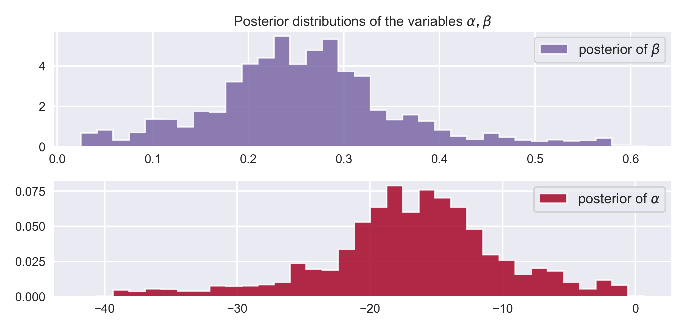
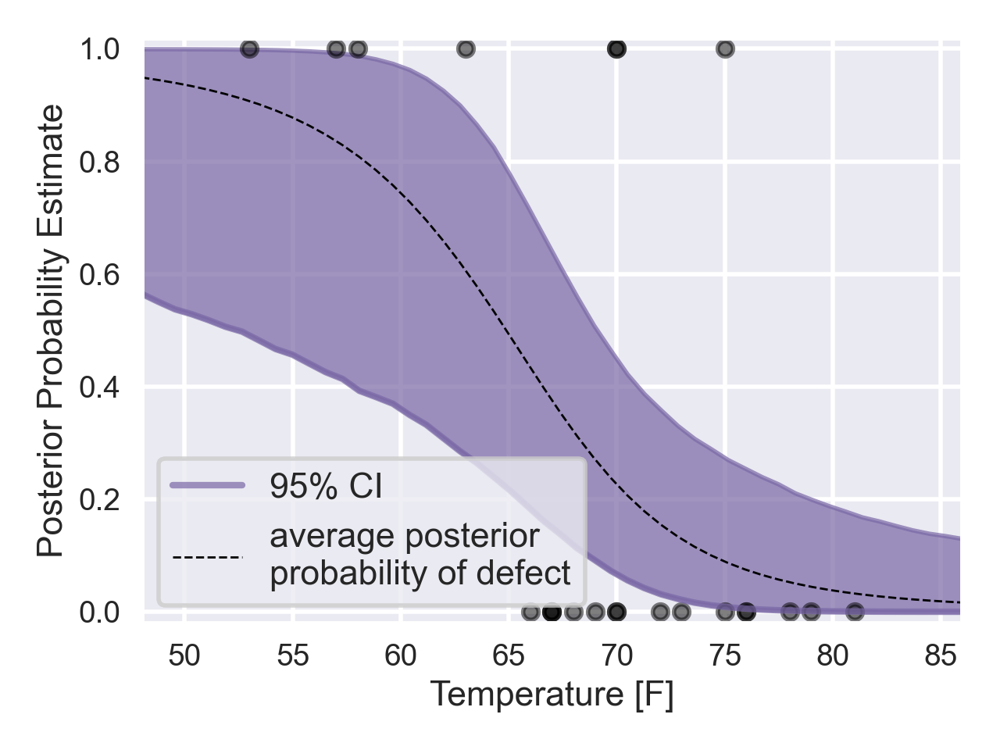

##  **ISP_bayesianStats**

```yaml
Name of QuantLet: ISP_bayesianStats

Published in:  An Introduction to Statistics with Python

Description: 'Example of PyMC - The Challenger Disaster
    This example uses Bayesian methods to find the  mean and the 95% confidence
    intervals for the likelihood of an O-ring failure in a space shuttle, as a function
    of the ambient temperature.
    Input data are the recorded O-ring performances of the space shuttles
    before 1986.'

Keywords: plot, fitting, bayesian statistics, logistic regression

See also:  ISP_logisticRegression

Author: Thomas Haslwanter 

Submitted: October 31, 2015 

Datafile: challenger_data.csv 

Example: Challenger_Parameters.png, Challenger_CIs.png
```





```py
'''Example of PyMC - The Challenger Disaster
This example uses Bayesian methods to find the  mean and the 95% confidence
intervals for the likelihood of an O-ring failure in a space shuttle, as a function
of the ambient temperature.
Input data are the recorded O-ring performances of the space shuttles before 1986.
'''

# author: Thomas Haslwanter, date: Nov-2015

# Import standard packages
import numpy as np
import matplotlib.pyplot as plt
from scipy import stats
import pandas as pd
import seaborn as sns
import os

# additional packages
import pymc as pm
from scipy.stats.mstats import mquantiles

# additional packages
import sys
sys.path.append(os.path.join('..', '..', 'Utilities'))

try:
# Import formatting commands if directory "Utilities" is available
    from ISP_mystyle import setFonts, showData 
    
except ImportError:
# Ensure correct performance otherwise
    def setFonts(*options):
        return
    def showData(*options):
        plt.show()
        return

sns.set_context('poster')

def logistic(x, beta, alpha=0):
    '''Logistic Function'''
    
    return 1.0 / (1.0 + np.exp(np.dot(beta, x) + alpha))

def getData():
    '''Get and show the O-ring data'''
    
    inFile = 'challenger_data.csv'
    
    challenger_data = np.genfromtxt(inFile, skip_header=1, usecols=[1, 2],
                                    missing_values='NA', delimiter=',')
    
    # drop the NA values
    challenger_data = challenger_data[~np.isnan(challenger_data[:, 1])]
    
    temperature = challenger_data[:, 0]
    failureData = challenger_data[:, 1]  # defect or not?
    return (temperature, failureData)

def showAndSave(temperature, failures):
    '''Shows the input data, and saves the resulting figure'''
    
    # Plot it, as a function of tempature
    plt.figure()
    setFonts()
    sns.set_style('darkgrid')
    np.set_printoptions(precision=3, suppress=True)
    
    plt.scatter(temperature, failures, s=200, color="k", alpha=0.5)
    plt.yticks([0, 1])
    plt.ylabel("Damage Incident?")
    plt.xlabel("Outside Temperature [F]")
    plt.title("Defects of the Space Shuttle O-Rings vs temperature")
    plt.tight_layout
    
    outFile = 'Challenger_ORings.png'
    showData(outFile)

def mcmcSimulations(temperature, failures):
    '''Perform the MCMC-simulations'''
    
    # Define the prior distributions for alpha and beta
    # 'value' sets the start parameter for the simulation
    # The second parameter for the normal distributions is the "precision",
    # i.e. the inverse of the standard deviation
    np.random.seed(1234)
    beta = pm.Normal("beta", 0, 0.001, value=0)
    alpha = pm.Normal("alpha", 0, 0.001, value=0)
    
    # Define the model-function for the temperature
    @pm.deterministic
    def p(t=temperature, alpha=alpha, beta=beta):
        return 1.0 / (1. + np.exp(beta * t + alpha))
    
    # connect the probabilities in `p` with our observations through a
    # Bernoulli random variable.
    observed = pm.Bernoulli("bernoulli_obs", p, value=failures, observed=True)
    
    # Combine the values to a model
    model = pm.Model([observed, beta, alpha])
    
    # Perform the simulations
    map_ = pm.MAP(model)
    map_.fit()
    mcmc = pm.MCMC(model)
    mcmc.sample(120000, 100000, 2)
    
    # --- Show the resulting posterior distributions ---
    alpha_samples = mcmc.trace('alpha')[:, None]  # best to make them 1d
    beta_samples = mcmc.trace('beta')[:, None]
    
    return(alpha_samples, beta_samples)

def showSimResults(alpha_samples, beta_samples):
    '''Show the results of the simulations, and save them to an outFile'''
    
    plt.figure(figsize=(12.5, 6))
    sns.set_style('darkgrid')
    setFonts(18)
    
    # Histogram of the samples:
    plt.subplot(211)
    plt.title(r"Posterior distributions of the variables $\alpha, \beta$")
    plt.hist(beta_samples, histtype='stepfilled', bins=35, alpha=0.85,
             label=r"posterior of $\beta$", color="#7A68A6", normed=True)
    plt.legend()
    
    plt.subplot(212)
    plt.hist(alpha_samples, histtype='stepfilled', bins=35, alpha=0.85,
             label=r"posterior of $\alpha$", color="#A60628", normed=True)
    plt.legend()
    
    outFile = 'Challenger_Parameters.png'
    showData(outFile)
    
    
def calculateProbability(alpha_samples, beta_samples, temperature, failures):
    '''Calculate the mean probability, and the CIs'''
    
    # Calculate the probability as a function of time
    t = np.linspace(temperature.min() - 5, temperature.max() + 5, 50)[:, None]
    p_t = logistic(t.T, beta_samples, alpha_samples)
    
    mean_prob_t = p_t.mean(axis=0)
    
    # --- Calculate CIs ---
    # vectorized bottom and top 2.5% quantiles for "confidence interval"
    quantiles = mquantiles(p_t, [0.025, 0.975], axis=0)
    
    return (t, mean_prob_t, p_t, quantiles)
    
def showProbabilities(linearTemperature, temperature, failures, mean_prob_t, p_t, quantiles):
    '''Show the posterior probabilities, and save the resulting figures'''

    # --- Show the probability curve ----
    plt.figure(figsize=(12.5, 4))
    setFonts(18)
    
    plt.plot(linearTemperature, mean_prob_t, lw=3, label="Average posterior\n \
    probability of defect")
    plt.plot(linearTemperature, p_t[0, :], ls="--", label="Realization from posterior")
    plt.plot(linearTemperature, p_t[-2, :], ls="--", label="Realization from posterior")
    plt.scatter(temperature, failures, color="k", s=50, alpha=0.5)
    plt.title("Posterior expected value of probability of defect, plus realizations")
    plt.legend(loc="lower left")
    plt.ylim(-0.1, 1.1)
    plt.xlim(linearTemperature.min(), linearTemperature.max())
    plt.ylabel("Probability")
    plt.xlabel("Temperature [F]")
    
    outFile = 'Challenger_Probability.png'
    showData(outFile)
    
    # --- Draw CIs ---
    setFonts()
    sns.set_style('darkgrid')
    
    plt.fill_between(linearTemperature[:, 0], *quantiles, alpha=0.7,
                     color="#7A68A6")
    
    plt.plot(linearTemperature[:, 0], quantiles[0], label="95% CI", color="#7A68A6", alpha=0.7)
    
    plt.plot(linearTemperature, mean_prob_t, lw=1, ls="--", color="k",
             label="average posterior \nprobability of defect")
    
    plt.xlim(linearTemperature.min(), linearTemperature.max())
    plt.ylim(-0.02, 1.02)
    plt.legend(loc="lower left")
    plt.scatter(temperature, failures, color="k", s=50, alpha=0.5)
    plt.xlabel("Temperature [F]")
    plt.ylabel("Posterior Probability Estimate")
    
    outFile = 'Challenger_CIs.png'
    showData(outFile)

if __name__=='__main__':
    (temperature, failures) = getData()    
    showAndSave(temperature, failures)
    
    (alpha, beta) = mcmcSimulations(temperature, failures)
    showSimResults(alpha, beta)
    
    (linearTemperature, mean_p, p, quantiles) = calculateProbability(alpha, beta, temperature, failures)
    showProbabilities(linearTemperature, temperature, failures, mean_p, p, quantiles)
    
    
    
    
    
```
